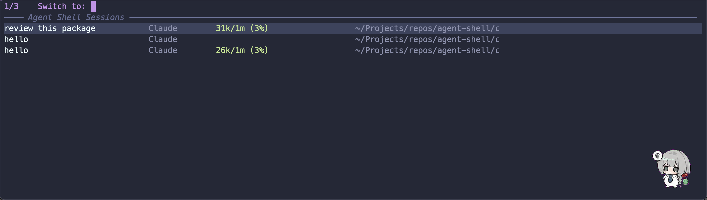

# `consult-agent-shell` - Search and Preview `agent-shell` Buffers

A [consult](https://github.com/minad/consult) source for navigating [agent-shell](https://github.com/xenodium/agent-shell) session buffers.  [marginalia](https://github.com/minad/marginalia) is used to display metadata for each buffer.



> Note that we have two sessions both named `hello`.

## Example Configuration

```emacs-lisp
(use-package consult-agent-shell
  :ensure t
  :vc (:url "https://github.com/szch79/consult-agent-shell")
  :config
  :bind (("C-x C-a" . consult-agent-shell))
  :config
  ;; These are the default values, customize them on need.
  (setopt consult-agent-shell-annotation-fields '(agent usage state cwd))
  (setopt consult-agent-shell-state-labels '((thinking . "thinking")
                                             (action   . "action")
                                             (idle     . "")))
  (setopt consult-agent-shell-title-max-width 50))
```

Then, `M-x consult-agent-shell` or `C-x C-a` will popup the completing-read with active agent-shell buffers.
